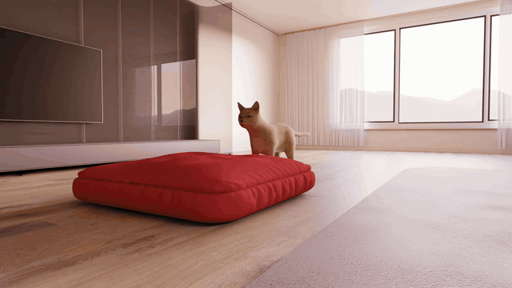

# Choreographing a World of Dynamic Objects

### CVPR 2026

Yanzhe Lyu*, Chen Geng*, Karthik Dharmarajan, Yunzhi Zhang, Hadi Alzayer, Shangzhe Wu, Jiajun Wu

[[`arxiv`](https://arxiv.org/abs/2601.04194)] [[`project page`](https://yanzhelyu.github.io/chord/)]



This is the official implementation of *Choreographing a World of Dynamic Objects*.

## Installation

Clone the repository with its submodules:

```bash
git clone --recursive git@github.com:yanzhelyu/CHORDCode.git
cd CHORDCode
```

If the repository was cloned without submodules, initialize them with:

```bash
git submodule update --init --recursive
```

Create the environment and install CUDA 12.8 / PyTorch 2.7.1:

```bash
conda create --name chord python=3.10
conda activate chord
conda install cuda -c nvidia/label/cuda-12.8.0

pip install --index-url https://download.pytorch.org/whl/cu128 torch==2.7.1+cu128 torchvision==0.22.1+cu128
```

Install Python dependencies:

```bash
pip install -r requirements.txt
pip install submodules/simple-knn --no-build-isolation
pip install "git+https://github.com/facebookresearch/pytorch3d.git" --no-build-isolation
pip install "git+https://github.com/NVlabs/nvdiffrast.git" --no-build-isolation
pip install git+https://github.com/nerfstudio-project/gsplat.git --no-build-isolation
pip install kaolin==0.18.0 -f https://nvidia-kaolin.s3.us-east-2.amazonaws.com/torch-2.7.1_cu128.html --no-build-isolation
pip install flash-attn --no-build-isolation
```

On Hopper GPUs, you can optionally install FA3 for faster attention kernels; please follow the original [FA repository](https://github.com/Dao-AILab/flash-attention) for instructions.


## External Assets

Download Wan 2.2 I2V checkpoints:

```bash
huggingface-cli download Wan-AI/Wan2.2-I2V-A14B --local-dir ./Wan2.2-I2V-A14B
```

Download the tiny VAE checkpoint used by `--use_tiny_vae`:

```bash
huggingface-cli download lightx2v/Autoencoders lighttaew2_1.pth --local-dir ./tiny_vae/
```

Download the CHORD example assets [here](https://drive.google.com/drive/folders/1WorTCNGD3O_4O5T_2962pz-mTIfPtvtC?usp=sharing) and unpack them into the repository root:


After setup, the expected layout is:

```text
CHORDCode/
├── data/
│   └── <scene_name>/
│       ├── scene.glb
│       ├── obj_0.glb
│       ├── obj_1.glb
│       └── obj_2.glb
├── trained/
│   └── <scene_name>/
│       ├── obj_0/
│       ├── obj_1/
│       └── obj_2/
├── Wan2.2-I2V-A14B/
└── tiny_vae/
    └── lighttaew2_1.pth
```

## Running CHORD On Your Own Scenes

For custom scenes, prepare object meshes and fit object/background 3D Gaussians before running CHORD. See [preprocess.md](docs/preprocess.md) for the expected mesh layout and Gaussian training commands.


After fitting the Gaussians, choose and validate a motion prompt before launching the full optimization. Since CHORD relies on video model distillation, optimization works best when the underlying video model can generate the desired motion conditioned on static renders of the scene. We therefore recommend generating and evaluating candidate prompts beforehand. Please see [prompt_creation_and_evaluation.md](docs/prompt_creation_and_evaluation.md) for instructions on prompt generation and evaluation.

## Run CHORD Optimization

Run CHORD with Wan 2.2 guidance:

In our experiments, using the smaller VAE from [LightX2V](https://github.com/ModelTC/LightX2V) gives nearly the same optimization quality as the full Wan VAE while making training much faster; a typical run finishes in around 12 hours on a H200. For this reason, the released code supports this tiny-VAE path through `--use_tiny_vae`.

For GPUs with 48 GB of VRAM or less, see [memory_constrained_training.md](docs/memory_constrained_training.md).

A typical training command is:

```bash
python train.py --ex_name <experiment_name> --mesh_source_path data/<scene_name> --model trained/<scene_name> --prompt "<prompt>" --ckpt_dir ./Wan2.2-I2V-A14B --task i2v-A14B --size "832*480" --use_tiny_vae --early_stop --batch_size 4 --resample_timestep
```

For multi-GPU training, launch the same command with `torchrun`; `--batch_size` is the per-GPU batch size:

```bash
torchrun --standalone --nproc_per_node <num_gpus> train.py --ex_name <experiment_name> --mesh_source_path data/<scene_name> --model trained/<scene_name> --prompt "<prompt>" --ckpt_dir ./Wan2.2-I2V-A14B --task i2v-A14B --size "832*480" --use_tiny_vae --early_stop --batch_size 2 --resample_timestep
```

<details>
<summary><span style="font-weight: bold;">Command Line Arguments for train.py</span></summary>

  #### --ex_name

  Name of this optimization run. Outputs are saved under `trained/<scene_name>/<experiment_name>`. If omitted, the run name defaults to `default`.

  #### --mesh_source_path

  Path to the scene mesh directory, such as `data/<scene_name>`.

  #### --model

  Path to the fitted 3D Gaussian directory, such as `trained/<scene_name>`.

  #### --obj_num

  Number of object meshes in the scene. The default `-1` auto-detects this from the top-level `obj_i.glb` files in `data/<scene_name>`, so you usually do not need to pass it.

  #### --prompt

  Text prompt that describes the desired object motion.

  #### --ckpt_dir

  Path to the Wan 2.2 I2V checkpoint directory.

  #### --size

  Wan SDS render resolution, written as `width*height`. Common choices are `832*480`, `576*320`, and `416*240`. The release command uses `832*480`; lower resolutions reduce GPU memory and runtime, but may provide less detailed guidance.

  #### --n_prompt

  Negative prompt passed to Wan guidance. By default is `"."` which would use the Wan 2.2 default negative prompts.

  #### --use_tiny_vae

  Use the Tiny VAE to encode rendered videos into SDS latents. We found this substantially speeds up training with little quality change.

  #### --tiny_vae_path

  Checkpoint path used by `--use_tiny_vae`. It defaults to `tiny_vae/lighttaew2_1.pth`; change it only if the downloaded Tiny VAE checkpoint is stored elsewhere.

  #### --early_stop

  Stop the optimization early at 2/3 iterations, which is usually enough.


  #### --lambda_ground

  Weight for the ground-contact penalty. Use `0.0` to disable the penalty for scenes where it is unnecessary.

  #### --batch_size

  Number of rendered camera views optimized per GPU per iteration.

  #### --lambda_arap

  Weight for ARAP regularization. Increase it if the motion becomes spatially distorted.

  #### --invert_bg_prob

  Probability control for background-color inversion during training; negative values disable this augmentation.

  #### --azim_l, --azim_r

  Azimuth range, in degrees, for sampling training cameras.

  #### --ref_azim

  Reference azimuth used for the canonical orbit camera.

  #### --elev_l, --elev_r

  Elevation range, in degrees, for sampling training cameras. Positive values place the camera above the scene.

  #### --cam_radius

  Camera distance from the scene center during training.

  #### --resample_timestep

  Resample Wan SDS timesteps during optimization instead of reusing a fixed schedule.

  #### --cp_num

  Number of dynamic control points initialized for each object. The release default is `60`.

  #### --add_cp_objs

  Object names that receive an additional control-point layer during training, such as `obj_0 obj_2`.

  #### --add_cp_layer_iter

  Iteration at which CHORD inserts the additional control-point layer for objects listed in `--add_cp_objs`.

  #### --add_cp_num

  Number of additional control points initialized for each object listed in `--add_cp_objs`.

  #### --lambda_dis_time

  Weight for temporal displacement regularization. Increase it if the motion looks wobbly.

  #### --last_cfg_scale, --init_cfg_scale

  Classifier-free guidance scale schedule used by Wan SDS, interpolated from the initial value to the final value during training.

  #### --frame_num

  Number of frames optimized in the dynamic sequence.

  #### --save_interval

  Iteration interval for saving checkpoints and visualizations.

  #### --log_run_time

  Print timing diagnostics for regularization, VAE/SDS preparation, DiT inference, and SDS backward passes. This is off by default and mainly useful for profiling.

  #### --enable_mmgp

  Use MMGP to manage Wan DiT CPU/GPU residency for very low-VRAM GPUs.

  #### --mmgp_profile

  MMGP residency profile used by `--enable_mmgp`. The default `4.0` is the low-RAM/low-VRAM profile used by Wan2GP.

  #### --mmgp_transformer_budget

  MMGP transformer VRAM budget in MB for `--enable_mmgp`. Increase it if you have spare VRAM and want less CPU/GPU transfer overhead.

  #### --split_sds_backward

  First render videos without gradients and compute detached Wan/DiT SDS targets. CHORD then releases the active DiT memory and re-renders each video for VAE/Tiny-VAE and Gaussian backward, so DiT target generation does not overlap with the VAE gradient graph and Gaussian render graph.

  #### --split_render_backward

  Further split backward at the rendered-video boundary inside `--split_sds_backward`. CHORD first backpropagates the VAE/Tiny-VAE loss to the rendered video, then re-renders the Gaussian video and applies that video gradient to reduce peak memory.

  #### --split_render_chunk_size

  Number of frames to re-render and backprop at once when `--split_render_backward` is enabled. The default `-1` disables chunking and backprops the full video at once; set this to `1` for the lowest-memory render backward path.

  #### --iterations

  Total number of optimization iterations.

</details>

Intermediate videos and checkpoints are written under:

```text
trained/<scene_name>/<experiment_name>/
├── deform/
├── eval_videos/
└── orbit_videos/
```

Some example scripts for the provided assets are available in `example/`. You can run them using:

```bash
bash example/ca_with_dog.sh
bash example/dv_with_lamp.sh
bash example/assassin_with_eagle.sh
bash example/robot_with_brick.sh
bash example/man_with_headphone.sh
bash example/child_with_seesaw.sh
bash example/cat_with_cushion.sh
```

## Export And Render Results

Render a saved CHORD checkpoint directly from one viewpoint:

```bash
python scripts/evaluation/render_scene.py -m trained/<scene_name> --mesh_source_path data/<scene_name> --ex_name <experiment_name> --checkpoint <checkpoint> --image_width 832 --image_height 480 --azim 60.0 --elev 10.0 --cam_radius 2.0 --save_fps 10 --lst_frame 41
```

<details>
<summary><span style="font-weight: bold;">Command Line Arguments for scripts/evaluation/render_scene.py</span></summary>

  #### -m

  Path to the fitted Gaussian directory, such as `trained/<scene_name>`.

  #### --mesh_source_path

  Path to the source mesh directory, such as `data/<scene_name>`.

  #### --ex_name

  Name of the CHORD optimization run to render.

  #### --obj_num

  Number of object meshes in the scene. The default `-1` auto-detects this from the top-level `obj_i.glb` files in `data/<scene_name>`.

  #### --checkpoint

  CHORD deformation checkpoint iteration to render. Use `-1` to load the latest saved deformation checkpoint.

  #### --image_width, --image_height

  Output render resolution in pixels.

  #### --azim

  Camera azimuth, in degrees, for the rendered viewpoint.

  #### --elev

  Camera elevation, in degrees. Positive values place the camera above the scene.

  #### --cam_radius

  Camera distance from the scene center.

  #### --save_fps

  FPS used for the saved preview video.

  #### --lst_frame

  Number of frames to render from the optimized sequence.

</details>

Export the optimized dynamic scene as an animated `.glb`:

```bash
python scripts/evaluation/save_dynamic_scene_glb.py --ex_name <experiment_name> --mesh_source_path data/<scene_name> -m trained/<scene_name> --checkpoint <checkpoint> --static_id 1 --save_fps 10 --lst_frame 41 --exclude_objs obj_1
```

<details>
<summary><span style="font-weight: bold;">Command Line Arguments for scripts/evaluation/save_dynamic_scene_glb.py</span></summary>

  #### --ex_name

  Name of the CHORD optimization run to export.

  #### --mesh_source_path

  Path to the source mesh directory, such as `data/<scene_name>`.

  #### -m

  Path to the fitted Gaussian directory, such as `trained/<scene_name>`.

  #### --obj_num

  Number of object meshes in the scene. The default `-1` auto-detects this from the top-level `obj_i.glb` files in `data/<scene_name>`.

  #### --checkpoint

  CHORD checkpoint iteration to export.

  #### --static_id

  Object id treated as the static background. The release convention uses `obj_1`.

  #### --save_fps

  FPS stored in the exported animation.

  #### --lst_frame

  Number of frames to export from the optimized sequence.

  #### --exclude_objs

  Objects to omit from the exported dynamic mesh, for example the static background `obj_1`.

</details>

The exported mesh is saved to:

```text
trained/<scene_name>/saved_meshes/iteration_<checkpoint>/dynamic_scene.glb
```

## Acknowledgements

This codebase builds on several open-source projects. We thank the authors of [Wan2.2](https://github.com/Wan-Video/Wan2.2), [LightX2V](https://github.com/ModelTC/LightX2V), and [SC-GS](https://github.com/CVMI-Lab/SC-GS) for their excellent work.

## Citation

If you find CHORD helpful, please consider citing:

```bibtex
@InProceedings{Lyu_2026_CVPR,
    author    = {Lyu, Yanzhe and Geng, Chen and Dharmarajan, Karthik and Zhang, Yunzhi and Alzayer, Hadi and Wu, Shangzhe and Wu, Jiajun},
    title     = {Choreographing a World of Dynamic Objects},
    booktitle = {Proceedings of the IEEE/CVF Conference on Computer Vision and Pattern Recognition (CVPR)},
    month     = {June},
    year      = {2026},
    pages     = {32647-32658}
}
```
